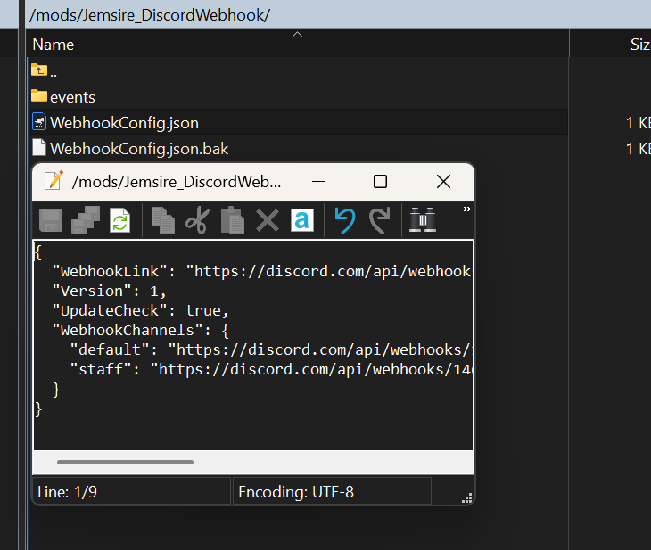
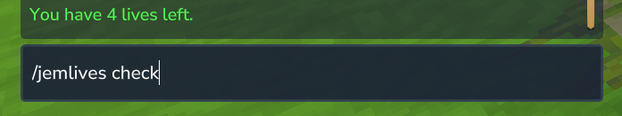

# JemDeaths


A Hytale server plugin that displays death messages in chat when players die. The plugin broadcasts death information to all players (or just the deceased player) and sends the death position to the player who died.

## Features

- **Death Message Broadcasting**: Displays death messages in chat with the format "Playername was killed by [cause]"
- **Configurable Display**: Choose whether to show death messages in chat and whether to broadcast to all players or just the deceased player
- **Death Position Tracking**: Automatically sends the player's death position coordinates after they die
- **Hot Reload**: Reload configuration without restarting the server using `/jemdeaths-reload`
- **Simple Configuration**: Easy-to-use configuration file with sensible defaults

## Installation

1. Download the latest release from the [releases page](https://github.com/jemsire/JemDeaths/releases)
2. Place the `JemDeaths-x.x.x.jar` file into your Hytale server's `mods` folder
3. Start your server to generate the configuration file
4. (Optional) Edit the `Jemsire_JemDeaths/DeathConfig.json` file to customize settings
5. In-game type `/jemdeaths-reload` to reload the config if you made changes

## Configuration

After first launch, a configuration file will be created at `Jemsire_JemDeaths/DeathConfig.json`:

```json
{
  "ShowDeathMessage": true,
  "ShowPosition": true,
  "DeathAnnouncementFormat": "<red>{player} {deathCause}",
  "DeathLocationFormat": "<gold>You last death position: {position}",
  "DeathCauseReplacement": "was"
}
```

### Configuration Options

- **ShowDeathMessage** (default: `true`): Enable sending the death message to everyone
  - When `true`: Death message is broadcast to all online players
  - When `false`: Death messages are disabled

- **ShowPosition** (default: `true`): Enable sending the position of the player's death to the player only
  - When `true`: The player receives a private message with their death coordinates
  - When `false`: Position notification is disabled

- **DeathAnnouncementFormat** (default: `"{player} {deathCause}"`): Customize the format of the death announcement message
  - Supports placeholders: `{player}`, `{playerName}`, `{deathCause}`, `{rawDeathCause}`, `{position}`, `{x}`, `{y}`, `{z}`
  - Example: `"[DEATH] {player} died: {deathCause}"` or `"Cant believe {player} {deathCause}"`

- **DeathLocationFormat** (default: `"<gold>You last death position: {position}"`): Customize the format of the death location message sent to the player
  - Supports placeholders: `{player}`, `{playerName}`, `{deathCause}`, `{rawDeathCause}`, `{position}`, `{x}`, `{y}`, `{z}`
  - Example: `"Your death location: {x}, {y}, {z}"` or `"Died at: {position}"`

- **DeathCauseReplacement** (default: `"was"`): What to replace "You were" with in the death cause
  - The game's death message typically starts with "You were", this setting replaces it
  - Example: `"was"` (default), `"got"`, `"perished from"`, etc.

### Color Formatting

Both `DeathAnnouncementFormat` and `DeathLocationFormat` support **color formatting** using tags or legacy color codes. The plugin will automatically detect and apply colors if present.

**Supported Color Formats:**
- **Named Color Tags**: `<red>`, `<blue>`, `<green>`, `<yellow>`, `<gold>`, etc.
- **Hex Color Tags**: `<#FF0000>` for custom colors
- **Legacy Color Codes**: `&a`, `&c`, `&e`, etc. (Minecraft/Hytale style)

**Available Named Colors:**
- `black`, `dark_blue`, `dark_green`, `dark_aqua`, `dark_red`, `dark_purple`
- `gold`, `gray`, `dark_gray`, `blue`, `green`, `aqua`
- `red`, `light_purple`, `yellow`, `white`

**Examples:**
```json
{
  "DeathAnnouncementFormat": "<red>{player} <gray>{deathCause}</gray>",
  "DeathLocationFormat": "<gold>You last death position: <#00FF00>{position}</#00FF00>"
}
```

Or using legacy codes:
```json
{
  "DeathAnnouncementFormat": "&c{player} &7{deathCause}",
  "DeathLocationFormat": "&6You last death position: &a{position}"
}
```

### Available Placeholders

Placeholders can be used in both `DeathAnnouncementFormat` and `DeathLocationFormat`:

- `{player}` or `{playerName}` - The player's display name
- `{deathCause}` - The formatted death cause (with "You were" replaced)
- `{rawDeathCause}` - The original death cause without replacement
- `{position}` - Full position as "x, y, z" (e.g., "123.4, 64.0, -567.8")
- `{x}` - X coordinate only (e.g., "123.4")
- `{y}` - Y coordinate only (e.g., "64.0")
- `{z}` - Z coordinate only (e.g., "-567.8")

### Example Configurations

**Default configuration:**
```json
{
  "ShowDeathMessage": true,
  "ShowPosition": true,
  "DeathAnnouncementFormat": "<red>{player} {deathCause}",
  "DeathLocationFormat": "<gold>You last death position: {position}",
  "DeathCauseReplacement": "was"
}
```

**Custom formatted messages:**
```json
{
  "ShowDeathMessage": true,
  "ShowPosition": true,
  "DeathAnnouncementFormat": "Cant believe {player} {deathCause}",
  "DeathLocationFormat": "Your death location: X:{x} Y:{y} Z:{z}",
  "DeathCauseReplacement": "got"
}
```

**Disable death messages (only position notification):**
```json
{
  "ShowDeathMessage": false,
  "ShowPosition": true,
  "DeathAnnouncementFormat": "<red>{player} {deathCause}",
  "DeathLocationFormat": "<gold>You last death position: {position}",
  "DeathCauseReplacement": "was"
}
```

**Disable position notification (only death messages):**
```json
{
  "ShowDeathMessage": true,
  "ShowPosition": false,
  "DeathAnnouncementFormat": "<red>{player} {deathCause}",
  "DeathLocationFormat": "<gold>You last death position: {position}",
  "DeathCauseReplacement": "was"
}
```

**Disable everything:**
```json
{
  "ShowDeathMessage": false,
  "ShowPosition": false,
  "DeathAnnouncementFormat": "<red>{player} {deathCause}",
  "DeathLocationFormat": "<gold>You last death position: {position}",
  "DeathCauseReplacement": "was"
}
```

## How It Works

### Death Message Format

When a player dies, the plugin displays a message in chat using the configured format (default: `"{player} {deathCause}"`).

For example with default settings:
- `Steve was killed by Zombie`
- `Alex was killed by fall damage`
- `Bob was killed by Creeper`

You can customize this format using the `DeathAnnouncementFormat` option with placeholders.

### Death Position Notification

After a player dies, they receive a private message with their death coordinates using the configured format (default: `"You last death position: {position}"`).

Example with default settings:
```
You last death position: 123.4, 64.0, -567.8
```

You can customize this format using the `DeathLocationFormat` option with placeholders. This helps players find their death location to retrieve items.

## Screenshots

### Configuration File


### In-Game Chat Example


## Commands

- `/jemdeaths-reload` - Reloads the plugin configuration without restarting the server
  - **Permission**: `jemdeaths.reload`
  - **Usage**: Use this command after modifying `DeathConfig.json` to apply changes

## Project Structure

```
JemDeaths/
├── src/main/java/com/jemsire/
│   ├── commands/
│   │   └── ReloadCommand.java           # Command handler for /jemdeaths-reload
│   ├── config/
│   │   └── DeathConfig.java             # Death message configuration data class
│   ├── events/
│   │   └── OnPlayerDeathEvent.java      # Handles player death events
│   ├── plugin/
│   │   └── JemDeaths.java               # Main plugin class
│   └── utils/
│       ├── ChatBroadcaster.java         # Utility for broadcasting messages
│       └── Logger.java                  # Logging utility
├── src/main/resources/
│   └── manifest.json                    # Plugin metadata
├── build.gradle.kts                     # Gradle build configuration
└── settings.gradle.kts                  # Gradle project settings
```

## Building from Source

### Prerequisites

- Java Development Kit (JDK) 25 or higher
- Gradle 8.0 or higher

### Build Steps

1. Clone the repository:
   ```bash
   git clone https://github.com/jemsire/JemDeaths.git
   cd JemDeaths
   ```

2. Ensure `HytaleServer.jar` is in the `libs/` directory

3. Build the project:
   ```bash
   ./gradlew build
   ```

4. The compiled JAR will be in `build/libs/JemDeaths-x.x.x.jar`

## Technical Details

### Dependencies

- **HytaleServer.jar**: Provided at compile time, required at runtime
- **Java Standard Library**: Uses standard Java libraries only

### Performance

- **Non-Blocking**: All operations run synchronously on the main thread (death events are already handled by the server)
- **Lightweight**: Minimal overhead, only processes death events
- **Efficient**: Direct chat message sending without external API calls

### Error Handling

- Gracefully handles missing player references
- Logs errors to server console if message sending fails
- Continues operation even if position tracking fails

## Troubleshooting

### Death Messages Not Appearing

1. **Check Configuration**: Verify that `ShowInChat` is set to `true` in `DeathConfig.json`
2. **Reload Config**: Use `/jemdeaths-reload` after making changes
3. **Check Server Logs**: Look for error messages in the server console
4. **Verify Permissions**: Ensure players have permission to receive chat messages

### Position Not Showing

1. **Check Server Logs**: Look for errors related to position tracking
2. **Verify Transform Component**: The plugin requires the Transform component to be available
3. **Check Player Reference**: Ensure the player is still online when the position is sent

### Permission Errors

- Ensure you have the `jemdeaths.reload` permission to use the reload command
- Check your server's permission system configuration

## Contributing

Contributions are welcome! Please feel free to submit a Pull Request.

## License

This project is licensed under the MIT License - see the LICENSE file for details.

## Author

**TinyTank800**

- Website: [https://jemsire.com/JemDeaths](https://jemsire.com/JemDeaths)

## Support

For issues, feature requests, or questions, please open an [Issue](https://github.com/jemsire/JemDeaths/issues).
